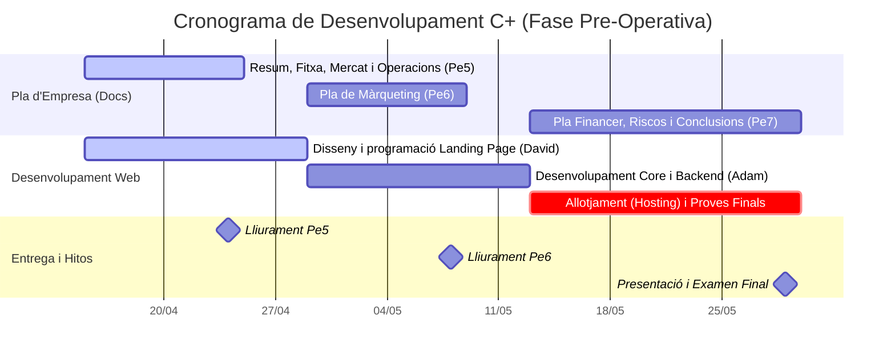

## Planificació del projecte (Gantt)

```mermaid
gantt
    title Cronograma de Desenvolupament C+ (Fase Pre-Operativa)
    dateFormat  YYYY-MM-DD
    axisFormat  %d/%m

    section Pla d'Empresa (Docs)
    Resum, Fitxa, Mercat i Operacions (Pe5) :active, doc1, 2025-04-15, 10d
    Pla de Màrqueting (Pe6)                 :doc2, 2025-04-29, 10d
    Pla Financer, Riscos i Conclusions (Pe7):doc3, 2025-05-13, 17d

    section Desenvolupament Web
    Disseny i programació Landing Page (David) :active, web1, 2025-04-15, 14d
    Desenvolupament Core i Backend (Adam)     :web2, 2025-04-29, 14d
    Allotjament (Hosting) i Proves Finals    :crit, web3, 2025-05-13, 17d

    section Entrega i Hitos
    Lliurament Pe5 :milestone, m1, 2025-04-24, 0d
    Lliurament Pe6 :milestone, m2, 2025-05-08, 0d
    Presentació i Examen Final :milestone, m3, 2025-05-29, 0d
```
