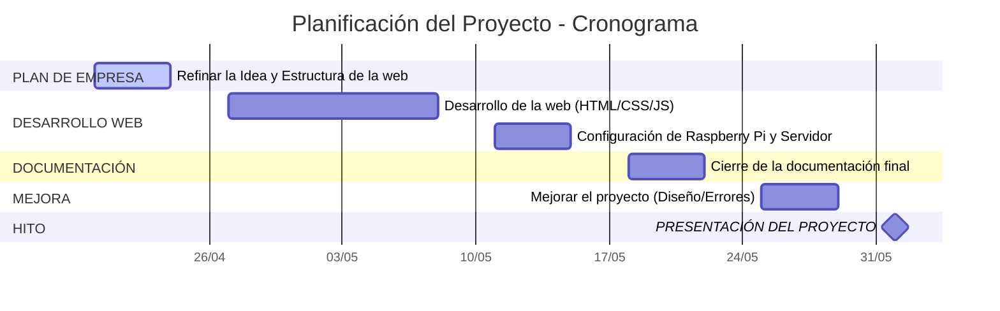

# C+

## Adam - David García

### Objectius
1. Redactar el pla d'empresa
2. Creació de la app
    - Creació del disseny
    - Implementació de HTML,CSS,JS

## Planificació del projecte (Gantt)

```mermaid
gantt
    title Planificación del Proyecto - Cronograma
    dateFormat  YYYY-MM-DD
    axisFormat  %d/%m
    tickInterval 1week

    section PLAN DE EMPRESA
    Refinar la Idea y Estructura de la web :active, a1, 2026-04-20, 2026-04-24
    
    section DESARROLLO WEB
    Desarrollo de la web (HTML/CSS/JS)    :a2, 2026-04-27, 2026-05-08
    Configuración de Raspberry Pi y Servidor :a3, 2026-05-11, 2026-05-15
    
    section DOCUMENTACIÓN
    Cierre de la documentación final       :a4, 2026-05-18, 2026-05-22
    
    section MEJORA
    Mejorar el proyecto (Diseño/Errores)   :a5, 2026-05-25, 2026-05-29
    
    section HITO
    PRESENTACIÓN DEL PROYECTO              :milestone, m1, 2026-06-01, 2026-06-01
```