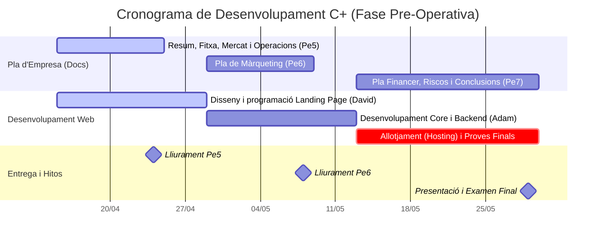

# Conduce+

## Adam - David García

### Objectius

- Ayudar a los nuevos candidatos que quieran obtener el nuevo modelo del examen de conducir.

- Crear una App Web que contenga cuestionarios para estudiar.

- Vender nuestra App Web a autoescuelas para así poder llegar a más gente.

- Crear una estructura de estudio innovadora para postularse al nuevo modelo del examen de conducir.

### Explicació del projecte

**Conduce+** es una startup que nace para salvar vidas atacando el problema olvidado de la seguridad vial: la erosión del conocimiento. Si entre el 70% y el 90% de los accidentes se deben al factor humano, es porque obtener el carnet B se considera el final de la formación, cuando debería ser solo el principio. Nuestra plataforma ofrece una solución educativa continua que refresca normas, enseña a reaccionar ante emergencias y actualiza al conductor sobre nuevas leyes de forma dinámica. El proyecto tiene un futuro brillante porque convierte la seguridad en un hábito digital, ofreciendo valor no solo al usuario, sino a empresas de transporte y aseguradoras que buscan reducir costes por siniestralidad. En un entorno de movilidad que cambia constantemente, C+ es la garantía de que el conductor siempre estará a la altura de las circunstancias.

### Material del projecte

- Visual Studio Code com a interfície de codi.
- Gemini com a eina de revisió.
- Duolingo com a referència de la aplicació web.
- Raspberry Pi per allotjar la web.

### Desenvolupament i desplegamnet (app i servidor)

Hemos utilizado una Raspberry Pi para alojar la web que hemos creado. El proceso es muy sencillo, instalamos un servidor web en la Raspberry Pi para permitir que la gente pueda entrar a ver nuestra web via la IP de la Raspberry en el navegador. El segundo paso que seguimos fue instalar un servidor FTP para poder pasar archivos desde uno de nuestros ordenadores del aula. Para poder llevar a cabo este proceso tuvimos que utilizar un software conocido, que es FileZilla. Como ya habíamos configurado el FTP en la Raspberry, al poner su IP en FileZilla desde nuestro PC pudimos subir los archivos necesarios para que nuestra web funcionase de forma correcta. Una vez hecho esto desde un ordenador que esté conectado a la misma red que la Raspberry ya puedes visualizar la web.

### Planificació (històries, sprints i diagrama de Gantt)

